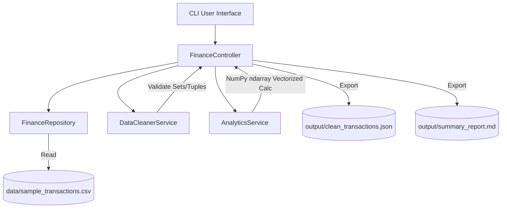

# FinSights - Personal Finance Analytics Engine 📊

> **FinSights** is a high-performance Python analytics engine demonstrating Month 1 Python fundamentals, core data structures, File I/O, layered architecture, and numerical analytics using **NumPy**.

---

## 🌟 Key Features

- 📥 **Data Ingestion & Cleaning**: Parses raw CSV records, validates amounts (`float`), deduplicates merchants (`Set`), standardizes category tags.
- 📐 **NumPy Analytics Engine**: Computes total spend, mean, median, standard deviation, min/max, 75th percentile, and anomaly thresholds using `np.ndarray`.
- 📊 **ASCII & Markdown Reporting**: Generates interactive CLI bar charts and exports formatted executive Markdown summary reports.
- 🏗️ **Layered Architecture**: Strict separation of concerns (CLI -> Controller -> Service -> Repository -> Models).

---

## 📚 Month 1 Python Concepts Demonstrated

| Concept | File / Module | Implementation Detail |
| :--- | :--- | :--- |
| **Data Types** | [`models.py`](finsights/models.py) | `int` (IDs), `float` (amounts), `str` (descriptions), `bool` (flags) |
| **Tuples** | [`models.py`](finsights/models.py) | `TransactionMeta(tx_id, date, merchant)` immutable header |
| **Lists** | [`data_cleaner.py`](finsights/services/data_cleaner.py) | Dynamic list storage for valid and rejected records |
| **Sets** | [`data_cleaner.py`](finsights/services/data_cleaner.py) | `VALID_CATEGORIES` set lookup & unique merchant deduplication |
| **Dictionaries** | [`analytics.py`](finsights/services/analytics.py) | Category spending aggregation map & metrics dict |
| **File Handling** | [`repository.py`](finsights/repository.py) | `csv.DictReader` parsing, JSON saving, Markdown writing |
| **Conditionals & Loops** | [`data_cleaner.py`](finsights/services/data_cleaner.py) | Record validation pipeline (`if/elif/else`) and `for` loops |
| **NumPy Engine** | [`analytics.py`](finsights/services/analytics.py) | `np.sum`, `np.mean`, `np.median`, `np.std`, `np.percentile` |

---

## 🏗️ Architecture Flow



---

## 📁 Repository Structure

```
zeravia-mini-project/
├── data/
│   └── sample_transactions.csv
├── docs/
│   └── features/
│       ├── feature_ingestion.md
│       ├── feature_analytics.md
│       └── feature_reporting.md
├── finsights/
│   ├── __init__.py
│   ├── models.py
│   ├── repository.py
│   ├── services/
│   │   ├── data_cleaner.py
│   │   └── analytics.py
│   ├── controllers/
│   │   └── finance_controller.py
│   └── cli.py
├── tests/
│   └── test_analytics.py
├── main.py
└── README.md
```

---

## 🚀 Getting Started

### Prerequisites
- Python 3.10+
- `numpy`

### Installation
```bash
git clone https://github.com/AbhilashDash10082k4/FinSights.git
cd FinSights
pip install numpy
```

### Running Application
```bash
python main.py
```

### Running Unit Tests
```bash
python -m unittest discover -s tests
```

---

## 📊 Sample Output Report

```markdown
# FinSights - Personal Finance Executive Summary

## Key Financial Metrics (NumPy Computed)
- **Total Spend**: $1,694.10
- **Average Transaction (Mean)**: $242.01
- **Median Spend**: $85.20
- **Standard Deviation**: $394.46
- **75th Percentile**: $177.80
- **Min / Max Spend**: $35.00 / $1,200.00
- **Anomalies Detected**: 1

## Spending by Category (ASCII Chart)
Groceries      | █████                          $355.60
Utilities      | ██                             $177.60
Electronics    | ██████████████████████████████ $1,200.00
Transport      |█                               $80.00
Dining         |█                               $68.40
Health         |█                               $50.00
Entertainment  |                                $15.99
```

---

## 📄 License
MIT License
